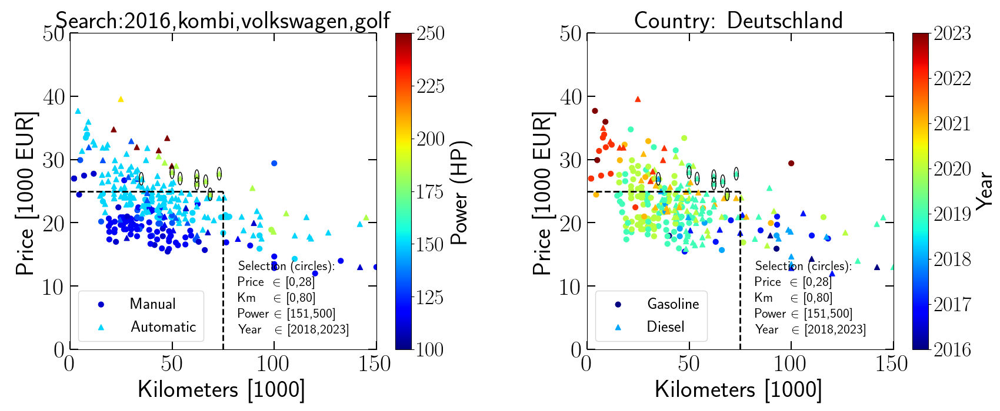
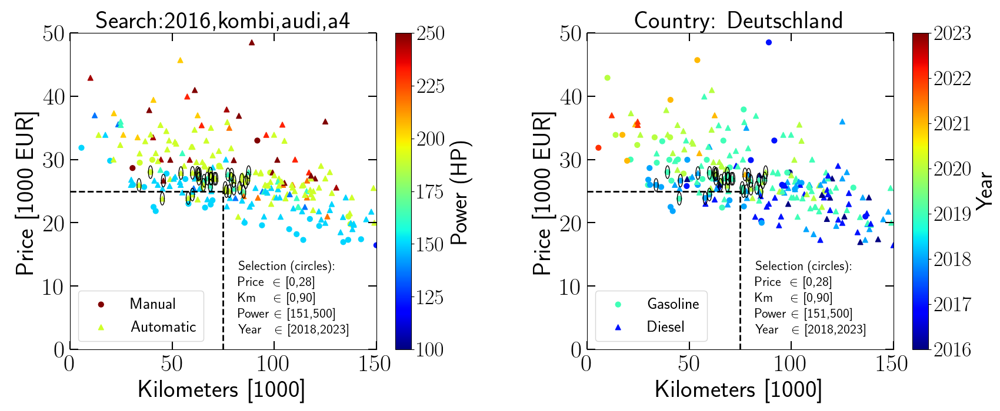

# Quick extraction of used car data and prices online
Simple set of python scripts that gather data from car websites (autoscout24.de , standvirtual.pt) and plot a few car properties together. Useful to rapidly browse available car offers and visualize market trends.

### Table of contents
- [Dependencies](#dependencies)
- [Running the scripts](#running-the-scripts)
- [Results overview for different cars, same country](#results-overview-for-different-cars-same-country)
- [Results overview for different countries, same car](#results-overview-for-different-countries-same-car)

### Dependencies

- numpy and matplotlib
- pandas
- bs4 - python web scraping library
- firefox browser (optional)

### Running the scripts
There are two sets of scripts: (i) one for offers in Germany from autoscout24.de and (ii) another for offers in Portugal from standvirtual.com. Their use is similar.

To get and plot data from autoscout24.de (German offers):
- choose search car options in *parameters_de.py*. Check existing examples; to add more check brand/model names in autoscout24.de.
- run *python scrape_autoscout24_de.py*. This saves a car data table in *data_store_de/*.
- run *python plot_data_de.py*. This makes a plot with key car data; the figure is saved in *fig_store_de/*. It also prints the URLs of selected car properties for closer inspection at the website. If *open_URL=True* (which can be selected inside the file), it will direcly open the selected URLs with firefox.

To get and plot data from standvirtual.com (Portuguese offers):
- choose search car options in *parameters_pt.py*. Check existing examples; to add more check brand/model names in standvirtual.com
- run *python scrape_standvirtual_pt.py*. This saves a car data table in *data_store_pt/*.
- run *python plot_data_pt.py*. This makes a plot with key car data; the figure is saved in *fig_store_pt/*. It also prints the URLs of selected car properties for closer inspection at the website.  If *open_URL=True* (which can be selected inside the file), it will directly open the selected URLs with firefox.

### Results overview for different cars same country
This figure plots the data for Volkswagen Golf (Variant submodel, *body_type='kombi'*) from autoscout24.de (Germany).

This figure plots the data for Audi A4 (Avant submodel, *body_type='kombi'*) from autoscout24.de (Germany).

The black dashed lines draw of box with some target maximum price and kilometers. As expected, there are far less Audi A4 than Volkswagen Golf in the target range.

### Results overview for different countries same car
These two figures plot the data from Mercedes-Benz Class C from autoscout24.de (Germany) and standvirtual.com (Portugal).

.png)

A few remarks from this figure include:
- the prices are visibly more expensive overall in Portugal than in Germany.
- in Germany there are far more options with more power (redder tonality on the left) compared to Portugal (bluer tonality on the left), suggesting the more powerful/sporty versions are not as sought after in Portugal.

Overall, given the option, Germany is a better place to look for Mercedes-Benz Class C. Playing around with these scripts for other car brands/models reveals the same general conclusion (which was well known, but can visualized now with the aid of these scripts/plots).

